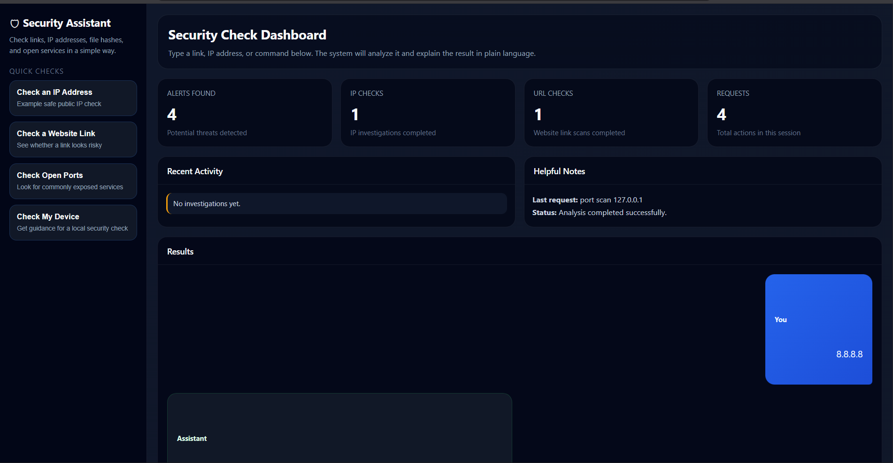
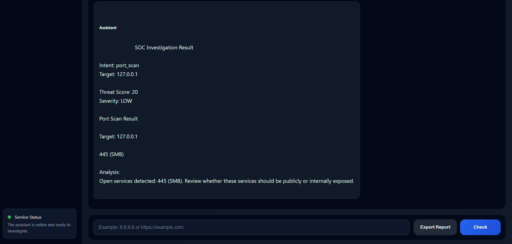
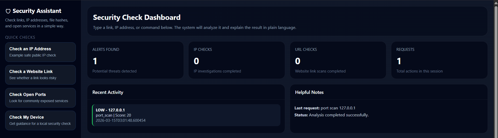

# 🛡 SOC AI Security Agent

🚨 A lightweight **AI-powered Security Operations Center (SOC) investigation platform** built with **Python and FastAPI**.

This system acts like a **virtual security analyst**, helping users investigate suspicious:

- IP addresses
- URLs / links
- file hashes
- network ports

through an **automated investigation workflow and an interactive dashboard**.

The goal of this project is to **make cybersecurity investigation simple and accessible even for non-technical users**, helping them understand potential threats before they cause harm.

---

# 📸 Dashboard Preview

## Security Dashboard


## Investigation Example


## Activity History


---

# 🚀 Project Overview

People often encounter suspicious things like:

- unknown links in emails
- suspicious IP addresses
- potentially malicious files
- unusual network activity

Most users **do not know how to investigate these safely**.

This project demonstrates how an **AI-driven investigation agent** can automate these security checks and provide **clear explanations and guidance**.

Users can simply enter commands such as:

```
8.8.8.8
https://example.com
port scan 127.0.0.1
investigate https://example.com
```

The AI agent automatically **detects the user's intent and runs the appropriate investigation tools.**

---

# ⚙ Installation & Setup

### Requirements

- Python 3.9+
- pip

### Steps

```bash
# 1. Clone the repository
git clone https://github.com/Rogger1412/soc-ai-security-agent.git
cd soc-ai-security-agent

# 2. Install dependencies
pip install -r requirements.txt

# 3. Run the application
uvicorn main:app --reload

# 4. Open in browser
http://localhost:8000
```

### Dependencies

| Package | Purpose |
|---------|---------|
| fastapi | Backend API framework |
| uvicorn | ASGI server |
| requests | HTTP requests for IP/URL scanning |
| python-nmap | Network port scanning |
| sqlite3 | Investigation history storage |
| dnspython | DNS resolution |

---

# 🧠 How the AI Agent Works

The system follows a simplified **SOC investigation workflow**:

```
User Input
   ↓
Intent Detection
   ↓
Target Extraction
   ↓
Investigation Planner
   ↓
Tool Execution Engine
   ↓
Threat Scoring
   ↓
AI Explanation
   ↓
Investigation Report
```

Each investigation may trigger multiple security checks such as:

- IP reputation analysis
- URL risk analysis
- DNS resolution
- port scanning
- incident response guidance

---

# 🔎 Key Features

## Automated Security Investigation

The AI agent automatically detects the investigation type and runs the correct security tools.

| Command | Action |
|--------|--------|
| `8.8.8.8` | IP reputation analysis |
| `https://example.com` | URL security scan |
| `port scan 127.0.0.1` | local port scanning |
| `investigate domain.com` | multi-step investigation |
| `I clicked this link` | incident response guidance |

---

## Threat Intelligence Analysis

The system evaluates risk using a **custom threat scoring engine**.

Threat indicators include:

- malicious reputation reports
- suspicious open ports
- risky services
- malware hash detections

Results are categorized as:

```
LOW
MEDIUM
HIGH
```

---

## SOC Investigation Dashboard

The web dashboard provides a **simple SOC-style interface** including:

- threat alerts
- investigation history
- recent activity monitoring
- investigation results
- automated security guidance

---

## Multi-Tool Security Engine

| Tool | Purpose | Library |
|------|---------|---------|
| IP Scanner | reputation analysis | requests |
| URL Scanner | phishing / malware detection | requests |
| Port Scanner | network exposure discovery | python-nmap |
| Hash Scanner | malware hash lookup | requests |
| Domain Resolver | domain → IP mapping | dnspython |

---

## Investigation Memory

The system stores investigation history including:

- timestamp
- investigation target
- investigation type
- threat score
- severity level

This simulates a simplified **SOC case tracking system.**

---

# 🏗 Architecture

```
Frontend Dashboard
        ↓
FastAPI Backend API
        ↓
AI Security Agent
        ↓
Investigation Planner
        ↓
Tool Execution Engine
        ↓
Security Scanners (requests, python-nmap, dnspython)
        ↓
Threat Scoring Engine
        ↓
Response Builder
        ↓
SQLite Database Logging
```

---

# 🖥 Technology Stack

| Component | Technology |
|-----------|------------|
| Backend | FastAPI |
| Frontend | HTML / CSS / JavaScript |
| Language | Python 3.9+ |
| Database | SQLite |
| Port Scanning | python-nmap |
| DNS Resolution | dnspython |
| HTTP Scanning | requests |
| Architecture | Modular AI Agent |

---

# 🧪 Example Investigation

User input:

```
investigate https://example.com
```

Agent workflow:

```
URL Scan (requests)
   ↓
Domain Resolution (dnspython)
   ↓
IP Reputation Analysis (requests)
   ↓
Port Scan (python-nmap)
   ↓
Threat Scoring
   ↓
Investigation Report
```

---

# ⚠ Limitations

This project currently uses custom-built scanners without live threat intelligence feeds.

Future improvements planned:

- VirusTotal API integration
- Shodan intelligence integration
- Real-time threat intelligence feeds
- Malware sandbox analysis
- Automated threat correlation

---

# 📚 Skills Demonstrated

- Python security tool development
- FastAPI backend engineering
- AI agent workflow design
- Cybersecurity investigation automation
- Security dashboard development
- Threat scoring algorithms
- Network scanning (Nmap)
- DNS analysis

---

# 👨‍💻 Authors

**Vishwa Patel** — [github.com/Rogger1412](https://github.com/Rogger1412)
**Heenaba Chauhan**

Cybersecurity students specializing in SOC automation, threat intelligence, and AI-driven security tools.